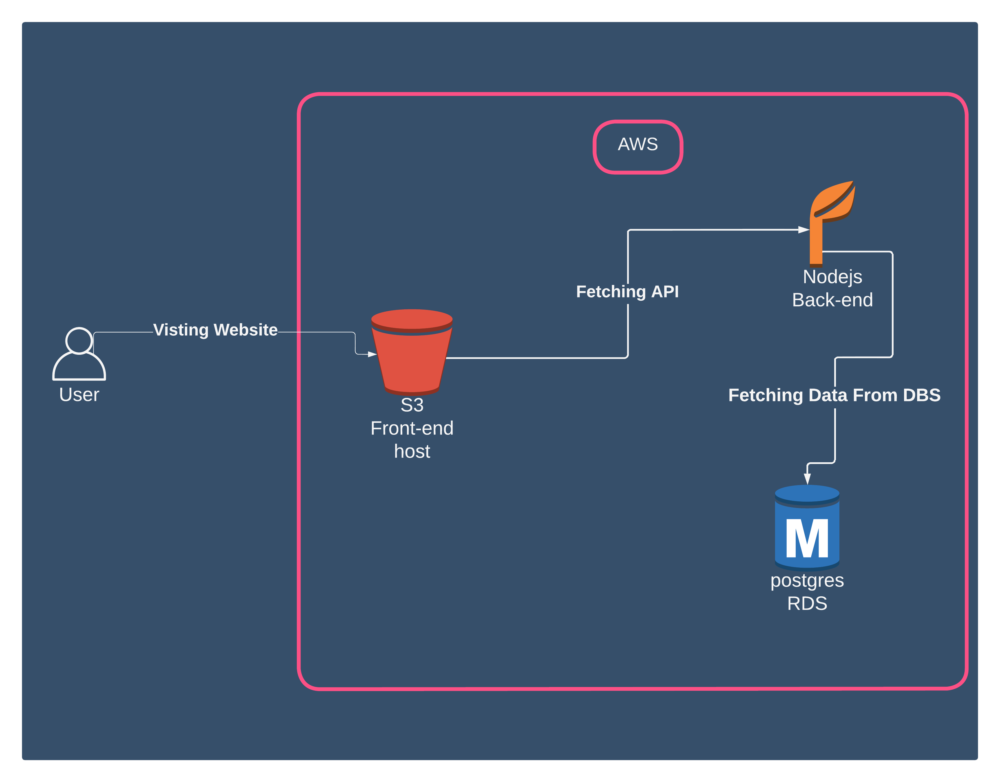

# Infrastructure

I'm using These Services for My Infrastructure:

1. AWS Elastic Beanstalk (Nodejs)

Elastic beanstalk is a web service that allows you to deploy applications on AWS. With pre-configured environments, you can deploy applications to the cloud in minutes. You can also use Elastic Beanstalk to create and manage environments.

link to the [AWS Elastic Beanstalk](http://udagram-backend-env.eba-3q2zgrnn.us-east-1.elasticbeanstalk.com/)

1. AWS RDS (Postgres)

RDS is a relational database service that provides you with a fully managed, secure, scalable, and reliable database.and it's working in AWS.

1. AWS S3 (S3)

S3 is a storage service that provides you with the ability to store data in the cloud.The data is stored in buckets and you can access it from anywhere in the world.And the data is stored as key, objects, which are stored in buckets.

link to the [AWS S3 frontend](http://udagram-buck.s3-website-us-east-1.amazonaws.com/)

