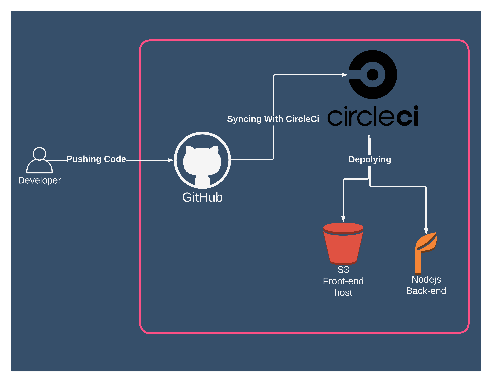

# PipeLine Architecture

I'm using

- GitHub as a sourcecode repository
- CircleCI as a continuous integration pipeline

## CircleCI Pipeline

### 1. Commiting the changes to Github Repo

When you make changes to the code, and you commit them to GitHub, CircleCI will build the code and deploy the code to the AWS Elastic Beanstalk.

### 2. Clone the repository

The repository is cloned to the Docker container in the CircleCI environment.

### 3. build the project

CircleCI builds the project and creates a Docker image.

the building sequence is:

1. frontend dependencies installation (npm install)
1. Api dependencies installation (npm install)
1. Frontend lint (ng lint)
1. Frontend build (ng build)
1. Api build (npm run build)

### 4. deploy the project

CircleCI deploys the API to the AWS Elastic Beanstalk environment and the FrontEnd to S3.

The deployment sequence is:

1. Frontend Deployment (npm run frontend:deploy)
1. Api Deployment (npm run api:deploy)

## Required ScreenShots
