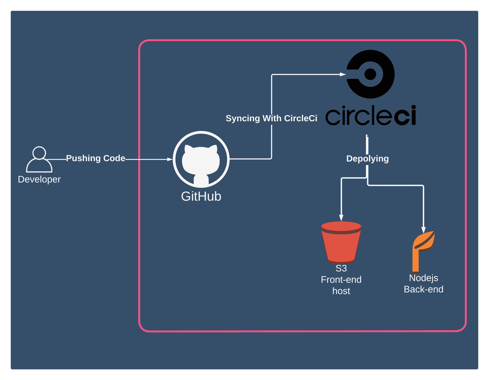

# Project Documentation

## Dependencies

The Dependencies is located in the `Deployment-Testing/Documentation/Docs/Dependencies.md` file.

[Dependencies](Docs/Dependencies.md)

## PipeLine Architecture

I'm using

- GitHub as a sourcecode repository
- CircleCI as a continuous integration pipeline

## Required ScreenShots

[NOTE]: All The required ScreenShots is Provided in the `Deployment-Testing/Documentation/Docs/Screenshotsd` file.

## Links

-[GitHub Repository](https://github.com/MrGaFs/Deployment-Testing)
-[CircleCI](https://circleci.com/gh/MrGaFs/Deployment-Testing)
-[FrontEnd](http://udagram-buck.s3-website-us-east-1.amazonaws.com/)
